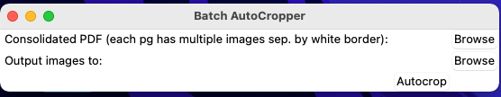
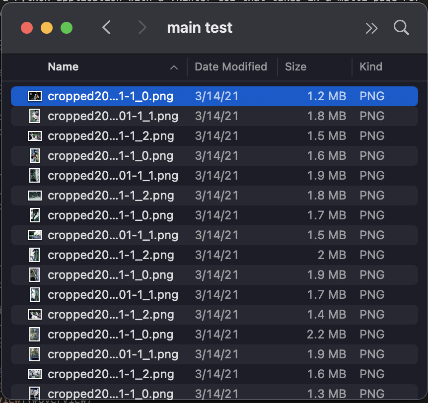
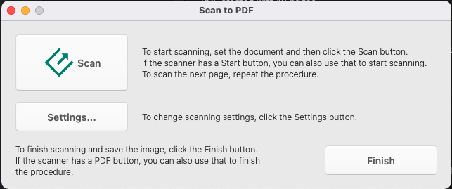
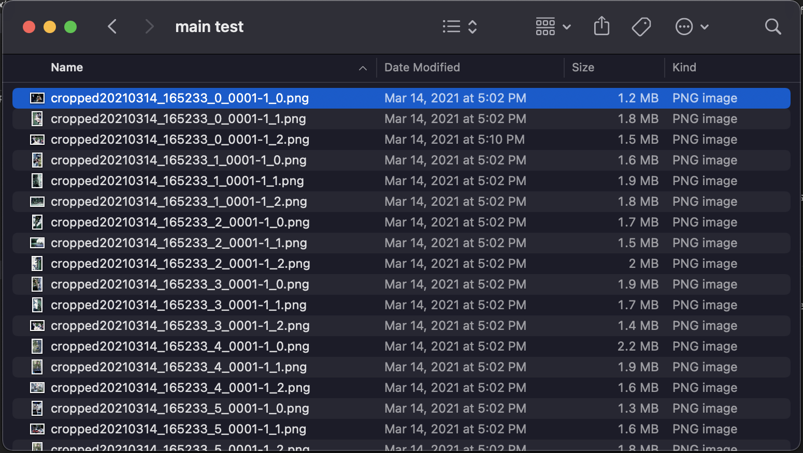

# Batch Scan Autocropper

This is a Python application with a Tkinter GUI that takes in a multi-page PDF of individual scans with 3-4 individual photos on each page (separated by scanner bed whitespace), and uses [OpenCV](https://pypi.org/project/opencv-python/) to detect and export the individual photos in the entire PDF.

I created this because the automatic cropping in Apple's [ImageCapture](https://support.apple.com/guide/image-capture/scan-images-imgcp1004/mac) and [Epson's ScanSmart](https://epson.com/Support/wa00870) software requires a preview scan (~8 seconds), approval of the detected edges (~5 seconds let's say), followed by 3 separate scans for each individual photo (~120 seconds for just 3 photos!).

Using this application paired with Epson's PDFNavi, the same result (3 individual photos) can be achieved in less than 15 seconds. This makes the monotonous task of scanning hundreds or thousands of old photos significantly faster, easier, and for better or worse, more monotonous.



Input PDF of scans            |  Output cropped images
:-------------------------:|:-------------------------:
 | 


## Table of contents
* [Usage](#usage)
* [Overview](#overview)
* [Installation](#installation)
* [Future Updates](#future-updates)

# Usage

1. Using Epson's SmartScan Suite that comes with Epson scanners, open the PDFNavi application:

    

2. Place 3-4 photos with a little whitespace between each on scanner bed, and click the green scan button. Replace photos and repeat as needed (recommend up to 15 scans to reduce load).

3. Click the "Finish" button, and you will have a multi page PDF with each scan:

    

4. Open Terminal and cd into project directory and run:

    ```
    make run
    ```
5. Select the PDF and the export location, and click Autocrop.

    

5. Output:

    

# Overview 

If you can fit 4 photos on a scanner bed at once, you should be able to press Scan and receive 4 separate images in return.

Unfortunately, this is not the case with Apple’s native Image Capture or Epson’s SmartScan suite. Auto detecting multiple photos requires a preview scan, confirmation of the bounding boxes, and is not easily repeatable in a monotonous way that scanning hundreds or thousands of photos requires. 

Other paid softwares exist that are infinitely better than those options, but they are expensive.

This project should be used in tandem with Epson's PDFNavi application.

Using this tool along with PDFNavi, I am able to digitze ~350 photos an hour.

Comparison for scanning 3 photos at once (and getting 3 separate files as output):

- Epson SmartScan: 84 seconds (and also not great at auto detection)
- Apple ImageCapture: 63 seconds
- My method: 9 seconds

<!-- https://www.reddit.com/r/DataHoarder/comments/ar0gts/helpful_reminder_scanners_dont_actually_scan_the/ -->

<!-- # Goal

This project’s goal is to make scanning as simple as placing 4 photos on the scanner bed (or as many as you can fit so long as they are separated by enough white space), pressing the scan button, then waiting a couple seconds (depending on scan quality settings).

Behind the scenes, basic OCR identifies the white space separating each individual photo, and exports each as a separate cropped image.

Then swap the photos out, place new ones in, and repeat. -->

# Installation

Navigate to the project's root directory via command prompt or Terminal.

First install the required openCV modules.

```
pip install opencv-python
```

Then install project requirements: 

```
pip install -r requirements.txt
```

This will take a minute or two as large computer vision modules are required.

<!-- # Usage

Use PDFNavi to scan photo batch to a consolidated PDF, where each page of the PDF is a scan (and each page has multiple photos separated by whitepsace).

Once done, click "Finish" and locate your PDF.

Open Terminal and cd into project directory and run:

```
make run
```

Choose the consolidated PDF file, and the output location. Then click Autocrop:
 -->


# Future Updates

Will add an EXIF date entry, so if you scan a photo album from August 1999, it will at least encode a month and year into every photo. That way, upon uploading to Google Photos, it will be sorted by date
